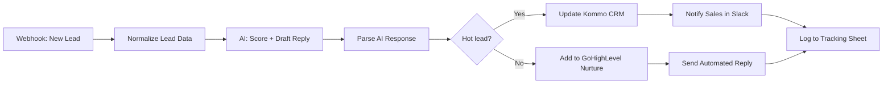

# AI Lead Qualification & CRM Auto-Sync

An n8n workflow that takes a raw inbound lead (website form, GoHighLevel, or
Kommo webhook), uses an LLM to score and draft a reply, then routes the lead
into the right CRM pipeline automatically — no manual triage.

## What it does

1. A webhook receives a new lead (name, email, phone, message, source).
2. The lead is normalized into a consistent shape.
3. An OpenAI call scores the lead `hot` / `warm` / `cold`, explains why, and
   drafts a short personalized first-touch reply.
4. **Hot leads** are pushed into **Kommo CRM** with a `hot-lead` tag and the
   sales team is pinged in Slack with the lead summary and suggested reply.
5. **Warm/cold leads** are added to a **GoHighLevel** nurture pipeline and
   sent the AI-drafted reply automatically by email.
6. Every lead is logged to a Google Sheet for tracking.

## Flow

## Why this design

- **LLM does judgment, not plumbing** — scoring and reply drafting are the
  only steps that need a model; routing, CRM writes, and notifications are
  deterministic so the workflow stays fast and cheap to run.
- **Two CRMs, one workflow** — Kommo and GoHighLevel are both wired in via
  their REST APIs so the same automation works regardless of which CRM a
  client is already using.
- **Human-in-the-loop for hot leads** — a hot lead gets a Slack ping with
  context instead of a fully automated reply, since high-intent leads
  convert best with a human touch.

## Import & configure

1. In n8n: **Workflows → Import from File** → select `workflow.json`.
2. Add credentials for: OpenAI, Kommo API, GoHighLevel (HighLevel) API,
   Slack, Gmail, Google Sheets.
3. Replace the placeholders in the HTTP Request nodes
   (`YOUR_KOMMO_SUBDOMAIN`, `YOUR_GOOGLE_SHEET_ID`) with your own.
4. Point your lead source (form / GoHighLevel / Kommo webhook) at the
   workflow's webhook URL.

**Status:** portfolio/demo build — designed and built by Zayam Mushtaq to
demonstrate AI-agent + CRM automation design. Not yet deployed for a live
client; built to be production-ready once credentials are attached.
