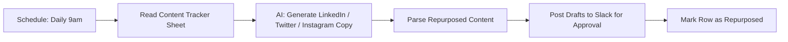

# AI Content Repurposing & Multi-Channel Publisher

An n8n workflow that watches for newly published content, uses an LLM to
repurpose it into platform-specific social copy, and routes the drafts to a
Slack channel for human approval before anything goes out.

## What it does

1. Runs daily on a schedule and reads a Google Sheet content tracker for
   rows marked `status: published` and `repurposed: no`.
2. For each item, an OpenAI call turns the title + summary into:
   - a LinkedIn post (professional tone, ~150-200 words)
   - a Twitter/X thread (4-6 short tweets)
   - an Instagram caption with hashtags
3. All three drafts are posted into a `#content-review` Slack channel for a
   human to review and approve before scheduling/publishing.
4. The sheet row is marked `repurposed: yes` with a timestamp so nothing
   gets processed twice.

## Flow

## Why this design

- **One source of truth** — a Google Sheet acts as the content calendar, so
  non-technical team members can mark what's published without touching
  the workflow.
- **Human approval before publishing** — the workflow drafts, it doesn't
  auto-post. Social copy still gets a human pass before it goes live.
- **Idempotent** — the `repurposed` flag means re-running the schedule never
  double-processes the same content.

## Import & configure

1. In n8n: **Workflows → Import from File** → select `workflow.json`.
2. Add credentials for: OpenAI, Slack, Google Sheets.
3. Create a Google Sheet named `ContentTracker` with columns: `title`,
   `summary`, `url`, `status`, `repurposed`, `repurposed_at`.
4. Replace `YOUR_GOOGLE_SHEET_ID` with your sheet's ID.

**Status:** portfolio/demo build — designed and built by Zayam Mushtaq to
demonstrate AI-agent + marketing automation design. Not yet deployed for a
live client; built to be production-ready once credentials are attached.
